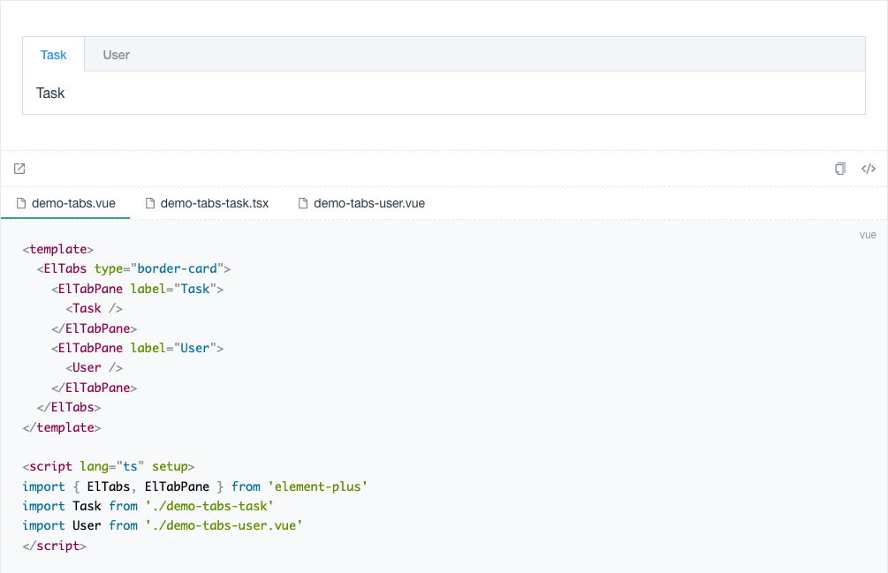

# vuepress-plugin-code-block-nossr

[文档及演示](https://bfehub.github.io/vmi/zh/guide/)

Vmi 是一个用于组件开发场景的 VuePress 的插件集合。尽量通过插件能有相似 Dumi 的 Demo 体验，又能保持 VuePress 强大的文档编写能力。

## 特性

- 强大的 demo 演示能力，支持多种展示模式。

- 支持页面路径映射，自定义组织组件文档。

- 支持翻译缺失，自动生成缺失语言的页面。

- 主题样式布局同步(**待完善**)。

## 示例

亮色模式



暗黑模式


## Issue

这个代码是从[@bfehub/vuepress-plugin-code-block](https://github.com/bfehub/vmi)Fork过来的，但是在实际场景发现一个比较严重的问题。

### 问题如下：
1. <span style="color: red">self is undefined</span>
2. <span style="color: red">document.getElementsByTagName is not a function</span>
3. <span style="color: red">window is not defined</span>
4. <span style="color: red">localstorge is not defined</span>


### 原因是：
某一些组件，或者第三方库会用到 document.querySelectory() 等js dom的api进行处理，而 vuepress 所有的页面在生成静态 HTML 时都需要通过 Node.js 服务端（ssr）渲染, Node.js 环境中自然没有 document 对象，这时候访问浏览器/DOM 中的 API 自然会报错。

### 解决方案是：

在路径：`src/node/parse/parseVue.ts`里面添加vuepress组件[ClientOnly](https://v2.vuepress.vuejs.org/zh/reference/components.html#clientonly)

```js
 node.content = [{
            tag: 'ClientOnly',
            content: [{
                    tag: 'VmiExample',
                    attrs: {
                        id: dep.compAttrs.id,
                        iframe: dep.compAttrs.iframe,
                        iframeSrc,
                        transform: dep.compAttrs.transform,
                    },
                    content: [{
                        tag: dep.compName,
                    }],
                },
            ]
        }

    ];
```


## License

The code is released under [the MIT license](https://github.com/bfehub/vmi/blob/master/LICENSE)
